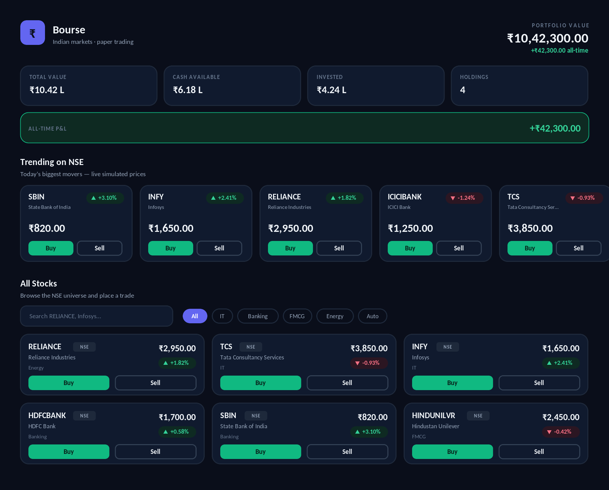
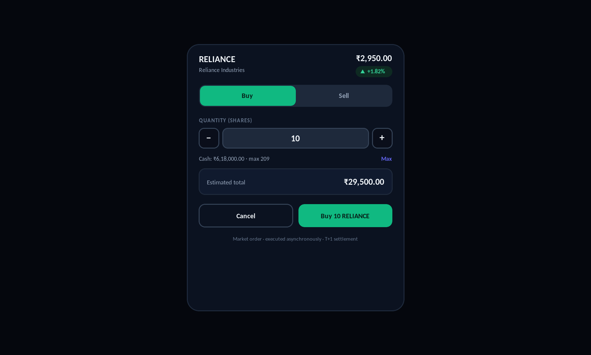
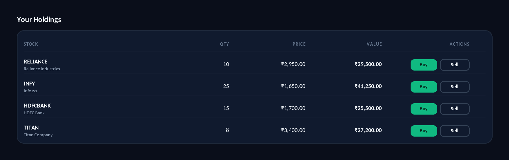

# Bourse

> An **Indian-market** paper-trading platform — browse trending NSE stocks, buy and sell them, and watch your portfolio update live. Built on a production-shaped, event-sourced Go backend with a custom Postgres job queue and a Redis rate limiter, fronted by a polished React UI.


---

## Preview

The trading dashboard — trending NSE movers, a searchable stock universe, and live portfolio summary, all in Indian numbering (lakh / crore):



Place a market order from anywhere — quantity stepper, live cash check, and estimated total:



Your holdings, derived live by replaying the event stream:



---

## Overview

An **Indian-market** paper-trading / portfolio platform. Browse trending NSE
stocks (RELIANCE, TCS, INFY, HDFCBANK, …), buy and sell them, and watch your
portfolio update live — backed by a serious, production-shaped Go backend and a
polished React frontend.

It combines three deep subsystems into one real-world product:

- **Event-sourced trading core** — every trade is an immutable, append-only,
  double-entry event. Cash and positions are *derived* by replaying the stream,
  never stored as mutable balances. Supports point-in-time queries and a full
  audit trail, and is safe against lost updates under concurrent orders.
- **Durable job queue** (built from scratch, Postgres-backed) — order execution,
  T+1 settlement, recurring market-data polling, and price-alert webhooks. Has
  visibility-timeout leasing, exponential-backoff retries, a dead-letter queue
  with replay, and idempotent handlers.
- **Token-bucket rate limiter** (Redis + atomic Lua) — guards every API endpoint
  per API key, with a sliding-window mode, restart-surviving state, and standard
  rate-limit headers.

Plus read-through **caching** of live quotes and derived portfolio snapshots, a
live external **market-data** integration (Finnhub NSE quotes, with a realistic
offline stub of ~25 real NSE large-caps), and a **beautiful React UI** for
browsing trending stocks and trading them.

Money is handled in **paise** (integers; ₹1 = 100 paise) and displayed with
Indian digit grouping (lakh / crore).

Written in Go, layered as **controller → service → repository**, with a
**Vite + React + Tailwind** frontend.

### Tech stack

| Area | Stack |
|---|---|
| Backend | Go 1.22, chi router, pgx |
| Data | PostgreSQL (event store + job queue), Redis (cache + rate-limit state) |
| Frontend | React 18, Vite, Tailwind CSS |
| Infra | Docker / docker-compose; deploys to Fly.io + Neon + Upstash |
| External | Finnhub market data (with an offline NSE stub) |

---

## Architecture

```
Client / UI ─► [Rate limiter middleware] ─► HTTP API (chi)
                                              │
                  ┌───────────────────────────┼───────────────────────┐
                  ▼                            ▼                        ▼
            PostgreSQL                      Redis                  Job queue
        (event store, orders,        (quotes, snapshots,      (Postgres-backed)
         jobs, dead-letters)          rate-limit buckets)      workers + reaper
                                                                     │
                                          execute · settle · poll quotes · webhooks
                                                                     │
                                                          External market-data API
```

### Layering (MVC)

| Layer | Package | Responsibility |
|---|---|---|
| Controller | `internal/controller` | HTTP request/response, validation mapping. Thin. |
| Service | `internal/service` | Business logic: trading, market data, queue, alerts. |
| Repository | `internal/repository` | All SQL. Accepts a `Querier` so it runs in or out of a transaction. |
| Infra | `internal/store`, `internal/cache`, `internal/ratelimit`, `internal/marketdata` | Postgres/Redis clients, caching, limiter, price provider. |
| Entrypoints | `cmd/api`, `cmd/worker` | Wire dependencies and run. |

---

## Prerequisites

- **Go 1.22+**
- **Node 18+** (for the React frontend; only needed for local non-Docker runs)
- **PostgreSQL 14+** and **Redis 7+** (or just Docker — see below)
- `psql` on your PATH (for running migrations locally)

---

## Quick start (Docker — recommended)

One command builds the React UI, then brings up Postgres, Redis, migrations, the
API, and the worker:

```bash
docker compose -f deploy/docker-compose.yml up --build
```

Then open **http://localhost:8080/** for the trading UI (the API serves the
built frontend).

To use real market prices instead of the stub:

```bash
MARKETDATA_PROVIDER=finnhub MARKETDATA_API_KEY=your_key \
  docker compose -f deploy/docker-compose.yml up --build
```

Tear down (including the database volume):

```bash
docker compose -f deploy/docker-compose.yml down -v
```

---

## Quick start (local, without Docker)

1. **Generate `go.sum` and fetch dependencies** (required once):

   ```bash
   make tidy        # == go mod tidy
   ```

2. **Start Postgres and Redis.** Easiest is via Docker:

   ```bash
   docker run -d --name bourse-pg -e POSTGRES_USER=bourse -e POSTGRES_PASSWORD=bourse \
     -e POSTGRES_DB=bourse -p 5432:5432 postgres:16-alpine
   docker run -d --name bourse-redis -p 6379:6379 redis:7-alpine
   ```

3. **Run migrations:**

   ```bash
   make migrate     # psql "$DATABASE_URL" -f migrations/0001_init.sql
   ```

4. **Run the API and the worker** in two terminals:

   ```bash
   make run-api
   make run-worker
   ```

5. **Run the frontend.** For development, the Vite dev server proxies the API:

   ```bash
   make web-dev        # http://localhost:5173 (hot reload)
   ```

   For a production-style run, build it once and let the API serve it:

   ```bash
   make web-build      # outputs frontend/dist
   ```

   Then open **http://localhost:8080/** — the API serves `frontend/dist`.

Configuration is via environment variables (see `.env.example`); every value has
a local default.

---

## Try it with curl

```bash
# Browse trending NSE stocks (top movers) and the full universe.
curl -s localhost:8080/v1/stocks/trending -H 'X-API-Key: demo'
curl -s localhost:8080/v1/stocks -H 'X-API-Key: demo'

# Create a portfolio seeded with ₹10,00,000 (amounts are in paise).
curl -s -XPOST localhost:8080/v1/portfolios \
  -H 'X-API-Key: demo' -H 'Content-Type: application/json' \
  -d '{"name":"demo","seed_paise":100000000}'
# -> {"id":"<PF>", ...}

# Place a market buy (execution is async via the worker).
curl -s -XPOST localhost:8080/v1/orders \
  -H 'X-API-Key: demo' -H 'Content-Type: application/json' \
  -d '{"portfolio_id":"<PF>","side":"buy","instrument":"RELIANCE","quantity":10,"type":"market"}'

# Read the derived portfolio (cash + positions + value).
curl -s localhost:8080/v1/portfolios/<PF> -H 'X-API-Key: demo'

# Point-in-time view.
curl -s "localhost:8080/v1/portfolios/<PF>?as_of=2026-06-26T00:00:00Z" -H 'X-API-Key: demo'

# Audit trail (the raw event stream).
curl -s localhost:8080/v1/portfolios/<PF>/history -H 'X-API-Key: demo'

# Queue health + dead-letter inspection.
curl -s localhost:8080/v1/admin/queue/stats -H 'X-API-Key: demo'

# Configure a rate limit for a key.
curl -s -XPUT localhost:8080/v1/admin/limits/demo \
  -H 'Content-Type: application/json' \
  -d '{"mode":"token","rate":5,"burst":10}'
```

Rate-limit headers (`X-RateLimit-Limit/Remaining/Reset`, `Retry-After` on 429)
are returned on every response.

---

## API reference

| Method | Path | Description |
|---|---|---|
| GET | `/v1/stocks` | Full NSE universe with live price + day-change %. |
| GET | `/v1/stocks/trending` | Top movers; `?limit=N` (default 6). |
| POST | `/v1/portfolios` | Create a portfolio (`name`, `seed_paise`). |
| GET | `/v1/portfolios/{id}` | Derived view; `?as_of=<RFC3339>` for point-in-time. |
| GET | `/v1/portfolios/{id}/history` | Event stream + recent orders (audit trail). |
| POST | `/v1/orders` | Place order; `Idempotency-Key` header or `idempotency_key` body field. |
| GET | `/v1/orders/{id}` | Order status. |
| DELETE | `/v1/orders/{id}` | Cancel a pending order. |
| GET | `/v1/quotes/{symbol}` | Live (cached) quote, e.g. `RELIANCE`. |
| POST | `/v1/alerts` | Create a price alert (`symbol`, `direction`, `threshold`, `webhook_url`). |
| GET | `/v1/admin/queue/stats` | Queue depth, in-flight, done, dead. |
| GET | `/v1/admin/queue/dead` | Dead-letter contents. |
| POST | `/v1/admin/queue/dead/{id}/replay` | Replay a dead-lettered job. |
| GET/PUT | `/v1/admin/limits/{key}` | Read / set per-key rate limit. |

Money is always in **paise** (integers; ₹1 = 100 paise); share quantities are
whole integers.

---

## Load test (correctness proofs)

With the stack running:

```bash
make loadtest         # or: go run ./loadtest
```

It asserts two properties:

1. **Rate limiter** — 500 concurrent requests against a tightly-limited key; the
   number allowed must match the token-bucket math (no double-spend).
2. **Trading concurrency** — buys a RELIANCE position, then fires 5 concurrent
   sells of the whole position; asserts exactly one fills and holdings never go
   negative (no lost updates).

---

## How the hard parts work

- **Double-entry:** a BUY writes a `+shares @ price` leg and a `-cash` leg whose
  signed values net to zero, both inside one transaction. The invariant is
  asserted in code before commit.
- **No lost updates:** order execution takes a `SELECT … FOR UPDATE` row lock on
  the portfolio, so concurrent trades on the same portfolio serialize.
- **Transactional outbox:** placing an order inserts the `orders` row *and* the
  `execute_order` job in the same transaction — they can never drift apart.
- **Queue safety:** workers claim jobs with `FOR UPDATE SKIP LOCKED` and a
  visibility lease; a reaper requeues jobs whose lease expired (crashed worker)
  and dead-letters those past `max_attempts`.
- **Idempotency:** re-executing an order is a no-op because the status has
  already moved off `pending`; repeated order submits with the same
  idempotency key return the original order.
- **Caching:** quotes are cached with a TTL; portfolio views are cached and
  invalidated on every trade.

---

## Deploy

The cheapest reliable combo is **Fly.io** (app) + **Neon** (Postgres) +
**Upstash** (Redis) — all have free tiers.

1. **Postgres — Neon** (https://neon.tech): create a project, copy the
   connection string, and run the migration against it once:

   ```bash
   psql "postgresql://...neon.../bourse?sslmode=require" -f migrations/0001_init.sql
   ```

2. **Redis — Upstash** (https://upstash.com): create a database and copy its
   `redis://` (or `rediss://`) URL.

3. **Market data — Finnhub** (https://finnhub.io, optional): grab a free API
   key. Skip this to run with the offline `stub` provider.

4. **App — Fly.io** (https://fly.io):

   ```bash
   curl -L https://fly.io/install.sh | sh        # install flyctl
   fly auth signup                                # or: fly auth login
   cd deploy
   fly launch --no-deploy --copy-config --dockerfile ../Dockerfile
   fly secrets set \
     DATABASE_URL="postgresql://...neon.../bourse?sslmode=require" \
     REDIS_URL="rediss://...upstash..." \
     MARKETDATA_PROVIDER="finnhub" \
     MARKETDATA_API_KEY="your_finnhub_key"
   fly deploy
   ```

   `fly.toml` runs the API and the worker as two process groups from the same
   image. After deploy, `fly open` gives you a public URL with the dashboards —
   put that link on your resume.

**Render alternative:** create a Web Service (Docker) for `/app/api` and a
Background Worker for `/app/worker` from the same repo, plus a free Render
Postgres and an Upstash Redis; set the same environment variables.

> Free-tier note: Neon/Upstash free databases sleep when idle and have small
> limits — fine for a portfolio demo, not for production traffic.

---

## Project layout

```
cmd/api          API server entrypoint
cmd/worker       background worker entrypoint
internal/
  config         env-based configuration
  model          domain types (Entry, Order, Job, ...)
  store          Postgres + Redis clients, Querier interface
  repository     SQL data access (portfolio, entry, order, job, alert)
  cache          Redis read-through cache (quotes, snapshots)
  ratelimit      token-bucket + sliding-window limiter (Lua)
  marketdata     price provider (stub + Finnhub)
  service        business logic (trading, marketdata, queue, alert)
  controller     HTTP handlers (incl. /v1/stocks, /v1/stocks/trending)
  middleware     rate-limit middleware
  api            chi router + SPA static serving + dependency wiring
  worker         job engine, handlers, lease reaper
migrations       SQL schema
frontend         Vite + React + Tailwind trading UI (built to frontend/dist)
loadtest         concurrency / rate-limit correctness harness
deploy           docker-compose.yml, fly.toml
```
